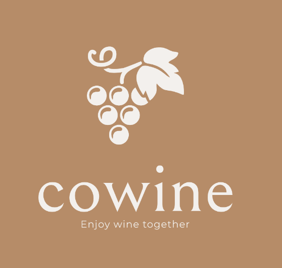

# Cowine

Deepbrain 2nd Project

### 안동주

- node.js
  jwt을 통한 로그인
  유저, 와인 데이터 mongodb 연동
  와인 정보 출력 api ( 산도, 바디감, 원산지 등 필터링)

- flask
  와인 평점 데이터 mysql 연동
  rest api 형태로 와인추천기능
- Docker
  node, flask 서버 Dockerfile 작성

### 성민호

- Python Selenium 을이용한 크롤링으로 mongoldb Mongoldb atals 에 와인데이터축적

- 프론트 -> 기능완성못함.
